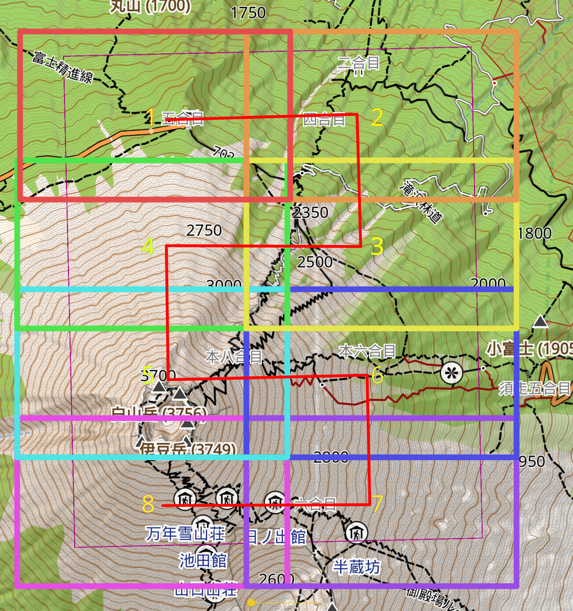

# Printable Map from OsmAnd

This is a tool to generate a printable topographic map by using screenshots from OsmAnd (https://osmand.net). The map uses the UTM grid and has declination information. It's to be used with a compass or a GPS device with UTM coordinates.

## Installation

Tested on Python 3.11

- Put the WMM/WMMHR Coefficient file download from https://www.ncei.noaa.gov/products/world-magnetic-model-high-resolution to the `wmm` directory.
- Install the requirements:
  ```shell
  pip install -r requirements.txt
  ```
- Install Bluestacks5(https://www.bluestacks.com/bluestacks-5.html) and have OsmAnd+ installed
- The Bluestacks VM should have a resolution of 3840x2160 and DPI of 320
- Optional: Import the `profiles/Hiking Map.osf` to OsmAnd

## Usage

First, run:

```shell
python topo_map_generator.py --paper_size A4 --orientation portrait 富士山 54S 295102 3917080 1:25000 topomaps/富士山
```

It will generate a GPX file to the `topomaps/富士山`.

Then import the `富士山.gpx` file into OsmAnd and take screenshots that overlapping and cover the whole region. The screenshots should be taken by using the arrow keys to follow a zigzag pattern.


Copy the screenshots to the `topomaps/富士山`. The program will merge all the screenshots and find 4 corners of the region. You could correct it and let the program generate the final map for you.

Example result:


## Known Issues

- Can not generate a map when the equator is in the region.
- Metric units only.

## License

The source in this repository falls under an MIT license (see LICENSE)